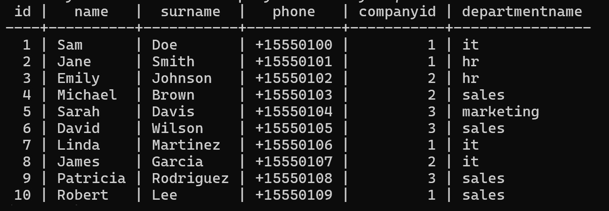
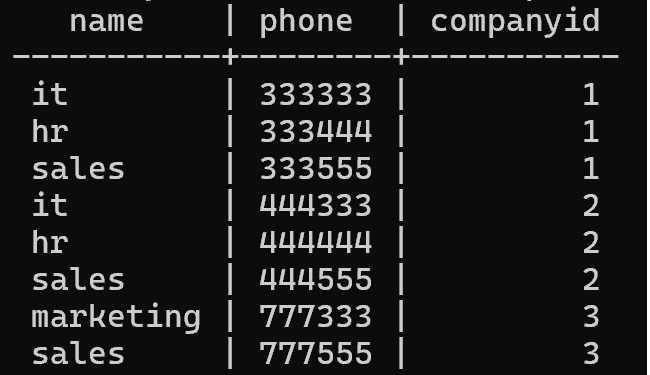

# Запуск сервера бд

1. Открыть папку db
2. Создать image с данными
```
docker build -t postgres:smartway .
```
3. Запустить контейнер
```
docker compose up -d
```
4. Запустить приложение
```
go run ..\cmd\smartway\main.go
```

# Запросы

Для удобства оствлю тут некоторые запросы
(powershell)

### Вывод всех сотрудников компании
```
 curl.exe -X GET -H 'Content-Type: application/json' 'http://localhost:8080/api/v1/emploees?id=2'
```
### Вывод сотрудников отдела
Отделы 1 и 2 компании (it, hr, sales)
Отделы 3 (marketing, sales)
```
curl.exe -X GET -H 'Content-Type: application/json' 'http://localhost:8080/api/v1/emploees?id=2&dep=sales'
```
``` 
curl.exe -X GET -H 'Content-Type: application/json' 'http://localhost:8080/api/v1/emploees?id=3&dep=it'
```

### Добавление сотрудника
В теле запроса нужно передать json со всеми полями. Id сотрудника и номер отдела можно  не указывать.

```
 curl.exe -X POST -H 'Content-Type: application/json' -H 'Authorization: smartway' -d '{\"Name\":\"Sally\",\"Surname\":\"Gardow\",\"Phone\":\"+15330107\",\"CompanyId\":2,\"Passport\":{\"Type\":\"regular\",\"Number\":\"1038\"},\"Department\":{\"Name\":\"it\"}}' 'http://localhost:8080/api/v1/emploee'
```
Если отдел или компания не существует, запрос отклонится
```
curl.exe -X POST -H 'Content-Type: application/json' -H 'Authorization: smartway' -d '{\"Name\":\"Ron\",\"Surname\":\"Willey\",\"Phone\":\"+17370707\",\"CompanyId\":1,\"Passport\":{\"Type\":\"regular\",\"Number\":\"1058\"},\"Department\":{\"Name\":\"marketing\"}}' 'http://localhost:8080/api/v1/emploee'

```

### Обновление сотрудника
```
curl.exe -X PUT -H 'Content-Type: application/json' -H 'Authorization: smartway' -d '{\"Id\":1,\"Name\":\"Sam\"}' 'http://localhost:8080/api/v1/emploee'

```
Если отдел или компания не существует, запрос отклонится

```
 curl.exe -X PUT -H 'Content-Type: application/json' -H 'Authorization: smartway' -d '{\"Id\":1,\"Name\":\"Jordan\", \"CompanyId\":5}' 'http://localhost:8080/api/v1/emploee'
```
### Удаление сотрудника
```
curl.exe -X DELETE -H 'Content-Type: application/json' -H 'Authorization: smartway' 'http://localhost:8080/api/v1/emploee?id=1'
```

# Данные бд
### Emploee


### Department
